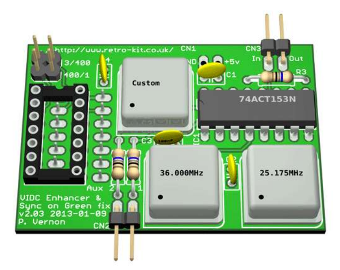

# Retro Kit "Ultimate" VIDC Enhancer

This project is a direct Altium import of Paul Vernon's Eagle files for his VIDC Enhancer.  All credit to Paul.  The following is his original documentation:

## VIDC Enhancer v2.03 (Ultra VIDC Enhancer)

The Ultra VIDC Enhancer provides a way to deliver the choice of up to four different clock signals including the on board 24MHz clock the the VIDC1a chip fitted to early Archimedes which could only provide a 24MHz clock signal by themselves.

Typically, a 25.175MHz and 36MHz oscillator are fitted to the board with a 220R pull down resistor in place of a possible third oscillator which, if fitted would allow you to overclock the VIDC chip beyond 36MHz.

Control and selection of the four clock signals is done by way of using the Aux IO connector on the Archimedes motherboard. Where previous VIDC Enhancers used just one connection to enable and disable the VIDC Enhancer clock provided, the Ultra VIDC Enhancer uses both connections as a binary pair to deliver the selection of VIDCCLK 0 through to VIDCCLK3 which are 24MHz, 25.175MHz, 36MHz and a custom speed respectively.

The clock selection is achieved by passing the clock signals through a non-inverting multiplexer which allows each of the four inputs to be individually selected for output.

## Sync on Green fix

The Sync on Green fix as found on version 1 of the VIDC Enhancer has been incorporated into the Ultra VIDC Enhancer to deliver the same level of functionality to older Archimedes machines that is provided by the A540 and later Acorn machines such as the A30x0, A4000 and A5000 machines and allows (S)VGA monitors to be connected to the Archimedes without losing the green component of the video signal.

## Overclocking

Overclocking the VIDC chip could lead to permanent damage of the VIDC chip or other associated hardware in your Archimedes. If you choose to fit an oscillator to overclock your VIDC chip beyond 36MHz, you do so at your own risk.

## VIDC Enhancer Vs. Ultra VIDC Enhancer

There are several differences between the VIDC Enhancer and the Ultra VIDC Enhancer which are outlined here:

* PCB design features a double sided full pour ground plane to reduce signal noise.
* Fewer logic gates are used to switch the clock signals
* Design provides improved power smoothing facilities
* Current protection resistors are present to protect the multiplexer IC and VIDC1a chip
* Only supports half-can oscillators
* Only marginally larger than the original design but delivers far more functionality
* No support for manual hardware control
* Only needs a single PCB to deliver multiple VIDC clock frequencies therefore has a much lower profile when fitted.

## Credits

The design of the Ultra VIDC Enhancer is my own design however I owe a debt of gratitude to Mr. Martin Barr who provided sanity checks for my design and put up with my endless photo's and video's of sinusoidal waves of different frequencies and quality as I developed the design on a breadboard.

The software to control the Ultra VIDC Enhancer is based on Andreas Barth's <a href="http://www.barth-welt.de/alt/1998/acorn/indexuk.htm">AutoVIDC module</a> for which he gave me permission to modify and distribute the updated version.</a>

I'd also like to thank Jon Abbott and Steve Harrison who both provided suggestions and encouragement in developing extra features into the RISC OS module, AutoVIDC.

## Further information

For further information, you can visit the Retro-Kit [Ultra VIDC Enhancer page](http://www.retro-kit.co.uk/Ultra-VIDC-Enhancer/)

[http://www.retro-kit.co.uk](http://www.retro-kit.co.uk)

[Notes.txt](Notes.txt)

[VIDC-Enhancer-manual-v2.pdf](VIDC-Enhancer-manual-v2.pdf)

[VIDC-Enhancer-AutoVIDC.pdf](VIDC-Enhancer-AutoVIDC.pdf)
